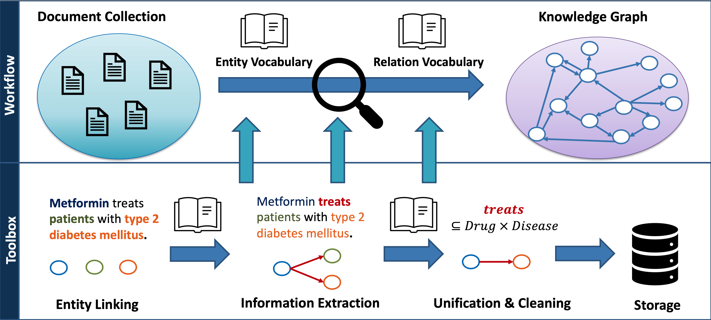
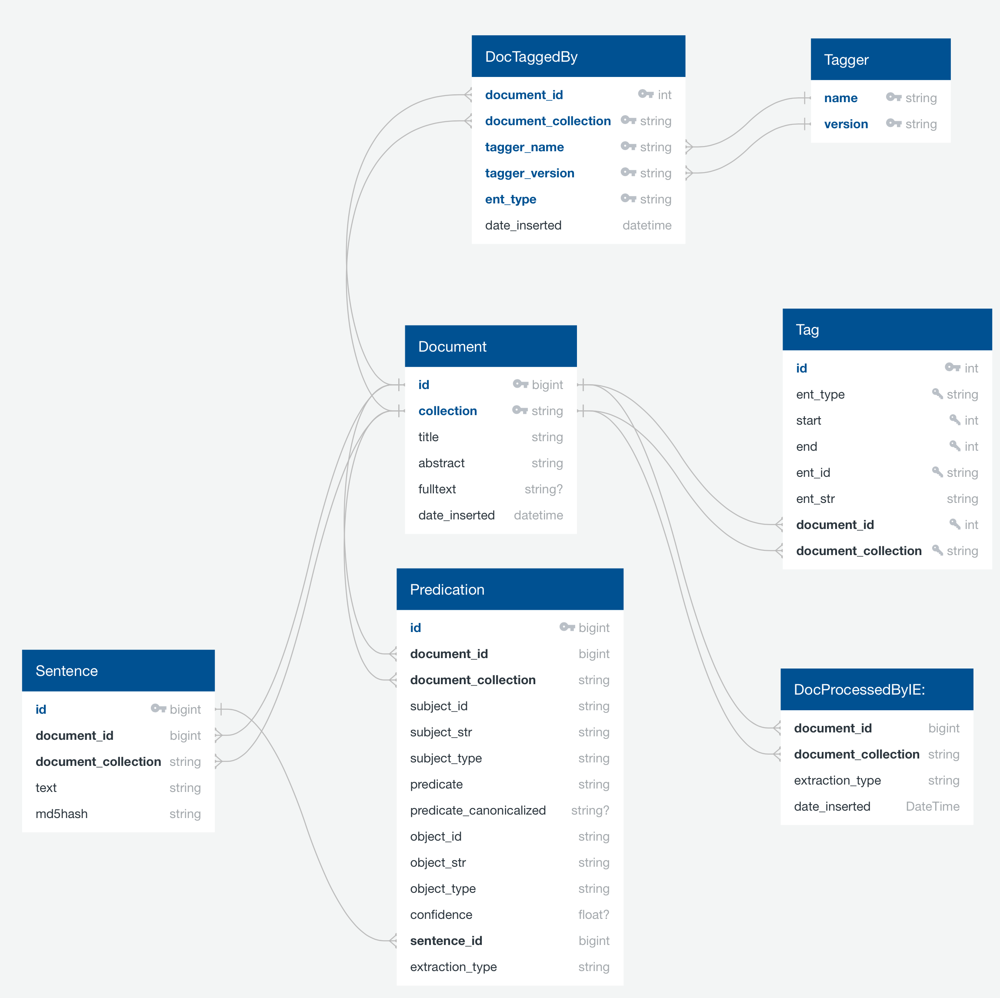

# Introduction
This GitHub project belongs to our JCDL2021 submission "A Toolbox for the Nearly-Unsupervised Construction of Digital Library Knowledge Graphs". 
The code is shared under the MIT license. Feel free to submit any problem or issue to this GitHub project.

If you use our project in your own research, then please cite:

```
@inproceedings{kroll2021toolbox,
  author = {H. Kroll and J. Pirklbauer and W. Balke},
  booktitle = {2021 ACM/IEEE Joint Conference on Digital Libraries (JCDL)},
  title = {A Toolbox for the Nearly-Unsupervised Construction of Digital Library Knowledge Graphs},
  year = {2021},
  volume = {},
  issn = {},
  pages = {21-30},
  doi = {10.1109/JCDL52503.2021.00014},
  url = {https://doi.ieeecomputersociety.org/10.1109/JCDL52503.2021.00014},
  publisher = {IEEE Computer Society},
  address = {Los Alamitos, CA, USA},
  month = {sep}
}
```

You can find our JCDL2021 conference talk here: [YouTube](https://youtu.be/G6ndS0GZBeg)
We evaluated our toolbox in three different collections: Wikipedia, Pharmacy (PubMed) and Political Sciences.
See the [Case Study Readme](README_CASE_STUDIES.md) for more details.


We applied the toolbox to the pharmaceutical domain. 
If you are interested in a possible application, watch our ICADL2021 talk: [YouTube](https://youtu.be/9N1XTXPEqfU)

```
@inproceedings{kroll2021narrativequerygraphs,
  author="Kroll, Hermann and Pirklbauer, Jan and Kalo, Jan-Christoph and Kunz, Morris and Ruthmann, Johannes and Balke, Wolf-Tilo",
  editor="Ke, Hao-Ren and Lee, Chei Sian and Sugiyama, Kazunari",
  title="Narrative Query Graphs for Entity-Interaction-Aware Document Retrieval",
  booktitle="Towards Open and Trustworthy Digital Societies",
  year="2021",
  publisher="Springer International Publishing",
  address="Cham",
  pages="80--95",
  isbn="978-3-030-91669-5"
}
```

# Toolbox Application Examples
There are several example files in the [resources](resources) folder. 
You may have a look at our [case studies](README_CASE_STUDIES.md).


# Toolbox Overview


The toolbox covers three central topics:
- Entity Linking and Named Entity Recognition
- Simple Text Classification
- Information Extraction
- Canonicalization and Cleaning

# General Setup
To use our toolbox, please follow the following setup procedure.

## Install Python
Install python >= 3.8. Decider whether you want to work with a global python version or with a conda environment (see [tutorial](https://towardsdatascience.com/getting-started-with-python-environments-using-conda-32e9f2779307))
### Dependencies
Install all packages from requirements.txt
```
pip3 install -r requirements.txt
```

### Python Path
You need to setup the python path. 
Replace the path to the project path.
This procedure must be repeated every time you create a new shell. You can add the path to your bash defaults.
```
export PYTHONPATH="$PYTHONPATH;/home/USER/KGExtractionToolbox/src/"
```

### Configuring NLTK
Please run the following script to configure NLTK:
```
python src/kgextractiontoolbox/setup_nltk.py
```

## Database configuration
The toolbox stores all produced data in a relational database. 
Setup the database configuration in the project
```
cd config/
cp backend.prod.json backend.json
nano backend.json
```
Please enter your database credentials in this file. We support Postgres and SQlite databases. 
If you would like to work with SQLite then enable the *use_SQLite* property and set a corresponding path.
```
{
  "use_SQLite": false,
  "SQLite_path": "sqlitebase.db",
  "POSTGRES_DB": "example",
  "POSTGRES_HOST": "127.0.0.1",
  "POSTGRES_PORT": "5432",
  "POSTGRES_USER": "user",
  "POSTGRES_PW": "pw",
  "POSTGRES_SCHEMA": "public"
}
```

The database schema is depicted below:


# Toolbox Components
Before you can use the toolbox, you must bring your documents into a compatible format and load them:
- [0 Document Formats & Loading](README_00_DOCUMENTS.md)


The extraction toolbox covers three essential components:
- [01 Entity Linking](README_01_ENTITY_LINKING.md)
- [02 Classification](README_02_CLASSIFICATION.md)
- [03 Extraction](README_03_EXTRACTION.md)
- [04 Cleaning](README_04_CLEANING.md)

If you would like to know how to use own of these components, follow the corresponding linked README. 
How data of our toolbox can be exported is described here:
- [04 Export Statements](README_05_EXPORT.md)


## Cleaning a Document Collection 
You can delete all information that are stored for a document collection by running:
```
python src/kgextractiontoolbox/backend/delete_collection.py COLLECTION
```
This will clean the database. 
The script will ask you for your agreement to delete the collection. 
We support a **--force** argument to directly delete the collection.
```
python src/kgextractiontoolbox/backend/delete_collection.py COLLECTION --force
```
