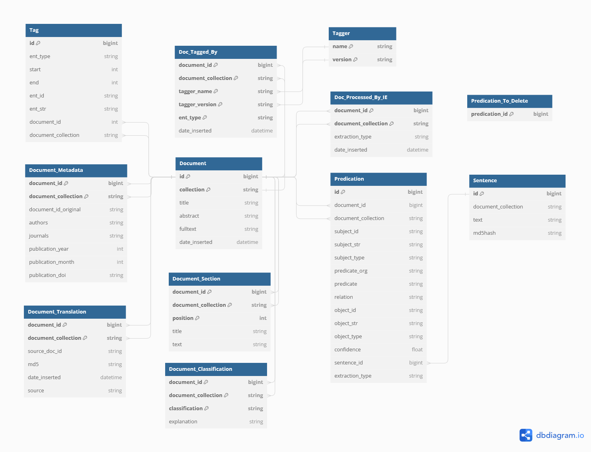

# Introduction
This GitHub project belongs to our JCDL2021 submission "A Toolbox for the Nearly-Unsupervised Construction of Digital Library Knowledge Graphs". 
The code is shared under the MIT license. Feel free to submit any problem or issue to this GitHub project.

If you use our project in your own research, then please cite:

```
@inproceedings{kroll2021toolbox,
  author = {H. Kroll and J. Pirklbauer and W. Balke},
  booktitle = {2021 ACM/IEEE Joint Conference on Digital Libraries (JCDL)},
  title = {A Toolbox for the Nearly-Unsupervised Construction of Digital Library Knowledge Graphs},
  year = {2021},
  volume = {},
  issn = {},
  pages = {21-30},
  doi = {10.1109/JCDL52503.2021.00014},
  url = {https://doi.ieeecomputersociety.org/10.1109/JCDL52503.2021.00014},
  publisher = {IEEE Computer Society},
  address = {Los Alamitos, CA, USA},
  month = {sep}
}
```

   
You can find our JCDL2021 conference talk here: [YouTube](https://youtu.be/G6ndS0GZBeg)

We applied the toolbox to the pharmaceutical domain. 
If you are interested in a possible application, watch our ICADL2021 talk: [YouTube](https://youtu.be/9N1XTXPEqfU)

```
@inproceedings{kroll2021narrativequerygraphs,
  author="Kroll, Hermann and Pirklbauer, Jan and Kalo, Jan-Christoph and Kunz, Morris and Ruthmann, Johannes and Balke, Wolf-Tilo",
  editor="Ke, Hao-Ren and Lee, Chei Sian and Sugiyama, Kazunari",
  title="Narrative Query Graphs for Entity-Interaction-Aware Document Retrieval",
  booktitle="Towards Open and Trustworthy Digital Societies",
  year="2021",
  publisher="Springer International Publishing",
  address="Cham",
  pages="80--95",
  isbn="978-3-030-91669-5"
}


```


# Toolbox Overview


The toolbox covers three central topics:
- Entity Linking and Namend Entity Recognition
- Information Extraction
- Canonicalization and Cleaning

# General Setup
To use our toolbox, please follow the following setup procedure.

## Install Python
Install python >= 3.8. Decider whether you want to work with a global python version or with a conda environment (see [tutorial](https://towardsdatascience.com/getting-started-with-python-environments-using-conda-32e9f2779307))
### Dependencies
Install all packages from requirements.txt
```
pip3 install -r requirements.txt
```

### Python Path
You need to setup the python path. 
Replace the path to the project path.
This procedure must be repeated every time you create a new shell. You can add the path to your bash defaults.
```
export PYTHONPATH="$PYTHONPATH;/home/USER/KGExtractionToolbox/src/"
```

## Database configuration
The toolbox stores all produced data in a relational database. 
Setup the database configuration in the project
```
cd config/
cp backend.prod.json backend.json
nano backend.json
```
Please enter your database credentials in this file. We support Postgres and SQlite databases. 
If you would like to work with SQLite then enable the *use_SQLite* property and set a corresponding path.
```
{
  "use_SQLite": false,
  "SQLite_path": "sqlitebase.db",
  "POSTGRES_DB": "example",
  "POSTGRES_HOST": "127.0.0.1",
  "POSTGRES_PORT": "5432",
  "POSTGRES_USER": "user",
  "POSTGRES_PW": "pw",
  "POSTGRES_SCHEMA": "public"
}
```

The database schema is depicted below:


## Cleaning a Document Collection 
You can delete all information that are stored for a document collection by running:
```
python src/kgextractiontoolbox/backend/delete_collection.py COLLECTION
```
This will clean the database. 
The script will ask you for your agreement to delete the collection. 
We support a **--force** argument to directly delete the collection.
```
python src/kgextractiontoolbox/backend/delete_collection.py COLLECTION --force
```

# Toolbox Components

The extraction toolbox covers three essential components:
- [01 Entity Linking](README_01_ENTITY_LINKING.md)
- [02 Extraction](README_02_EXTRACTION.md)
- [03 Cleaning](README_03_CLEANING.md)

If you would like to know how to use own of these components, follow the corresponding linked README. 
How data of our toolbox can be exported is described here:
- [04 Export Statements](README_04_EXPORT.md)

There are several example files in the [resources](resources) folder.


# Supported Document Formats

Our Pipeline supports two document formats (JSON and Pubtator). Every document is identified via an unique id (integer). 
Documents must belong to a document collection, but each document id must be unique within the collection.


## Loading Documents
You can load your documents:
```
python src/kgextractiontoolbox/documents/load_document.py DOCUMENTS.json --collection COLLECTION
```
Document ids must be unique integers within a document collection. 
The loading procedure will automatically include entity annotations (tags) if contained in the document file. 
If you don't want to include tags, use the **--ignore_tags** argument.

```
python src/kgextractiontoolbox/documents/load_document.py DOCUMENTS.json --collection COLLECTION --ignore_tags
```

A document file may contain only annotations (exported by our toolbox; see [export](README_04_EXPORT.md)).
The toolbox will only load these annotations if the corresponding documents with titles or abstracts have been inserted into the database.


### Document JSON Format
Here is an example of our JSON format:
```
[
  {
      "id": 12345,
      "title": "Barack Obama [...]",
      "abstract": "Obama was born in Honolulu, Hawaii. After graduating from Columbia University in 1983 [..]",
  },
  // more documents ...
]
```
The outmost array brackets `[]` can be omitted if only a single json document should be contained within the file.

Note:
- a document id must be an integer
- id, title and abstracts are required

### Document PubTator Format
The second document format is the so-called [PubTator format](https://www.ncbi.nlm.nih.gov/CBBresearch/Lu/Demo/PubTator/tutorial/index.html). 
A PubTator document has a document id, a document collection, a title and an abstract. 
```
document_id|t|title text here
document_id|a|abstract text here

```
ATTENTION: the PubTator file must end with two *\n* characters. 
The document id must be an integer. Title and abstract can include special characters - the texts will be sanitized in our pipeline. 
If you want to tag several documents, you can choose from two options:
1. Create a PubTator file for each document and put them into a directory
2. Create a single PubTator file with several documents
```
document_id_1|t|title text here
document_id_1|a|abstract text here

document_id_2|t|title text here
document_id_2|a|abstract text here

document_id_3|t|title text here
document_id_3|a|abstract text here

```
The files are separated by two new line characters *\\n*. ATTENTION: the PubTator file must end with two *\\n* characters. 


### Expert Loading for Custom Tagging
The following is only of interest, if you are working with custom taggers.
In addition, you can specify a tagger map when loading a document file. 
Then, the database will store the information that these files have been processed by the corresponding taggers.
This is useful, if you work with custom taggers, and you don't want to annotate document twice.
As an example:
```
{
  "Chemical" : ["TaggerOne", "0.2.1"],
  "Disease" : ["TaggerOne", "0.2.1"],
  "DosageForm": ["DosageFormTagger" , "1.0.0"],
  "Gene" : ["GNormPlus", "unknown"],
  "Species" : ["SR4GN", "unknown" ],
  "CellLine" : ["TaggerOne", "0.2.1"],
  "Variant" : [ "tmVar", "2.0"]
}
```
Then, run
```
python src/kgextractiontoolbox/documents/load_document.py DOCUMENTS.json --tagger_map TAGGER_MAP.json --collection COLLECTION
```